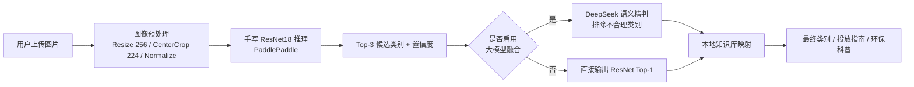

# 基于 ResNet18 与 DeepSeek 大模型融合的垃圾分类图像识别系统

> 厦门大学 2024 级「学科实践 II」课程项目
> 视觉模型负责快速粗分类，大语言模型负责语义纠错与投放知识生成。

本项目实现了一套完整的垃圾图像自动识别与投放指导系统：使用 **PaddlePaddle 手写 ResNet18** 完成 5 类生活垃圾的图像分类，
再通过 **DeepSeek 大模型** 对分类结果进行语义精判，最终输出垃圾类别、投放指南与环保科普，
并提供基于 **Flask** 的 Web 可视化界面与 **PyInstaller** 打包的可执行程序。

---

## 一、系统架构



**设计思路**：卷积网络擅长纹理与形状判别，但对「压扁的纸盒 vs 平板玻璃」这类视觉相近、语义可区分的样本容易混淆；
因此系统在视觉模型给出 Top-3 候选后，交由大模型结合常识做二次筛选，从而提升最终判定结果的合理性。
当 API 不可用或未配置密钥时，系统自动降级为纯 ResNet 推理，保证服务不中断。

---

## 二、功能特性

- **手写 ResNet18**：完全基于 PaddlePaddle 从 `BasicBlock` 搭建，不调用框架预封装模型，网络结构清晰可读。
- **5 类垃圾分类**：cardboard（纸板）、glass（玻璃）、metal（金属）、paper（纸张）、plastic（塑料）。
- **大模型融合精判**：对接 DeepSeek Chat API，对 Top-3 候选做常识推理，输出最合理类别。
- **投放知识库**：内置各类别的投放指南与环保科普文案，无需额外查询。
- **Web 可视化系统**：支持拖拽上传、Top-3 置信度条形展示、推理耗时统计，界面美观可直接演示。
- **完整训练链路**：自动扫描数据集、8:2 随机划分、保存最优权重、VisualDL 曲线可视化、训练日志落盘。
- **可打包分发**：已用 PyInstaller 打包为免安装 Windows 可执行程序，便于答辩现场演示。

---

## 三、目录结构

```
.
├── resnet18.py                 # 手写 ResNet18 网络结构（BasicBlock + 残差层）
├── train.py                    # 训练脚本：数据扫描 / 划分 / 训练 / 保存最优模型 / 日志
├── inference.py                # 推理脚本：加载权重，输出 Top-1 / Top-3
├── llm_fusion.py               # 大模型融合模块：Prompt 构造 + DeepSeek API + 知识库
├── app.py                      # Flask Web 系统（上传、预览、结果展示）
├── main.py                     # 命令行总入口（训练 / 推理 / 全流程）
├── config.py                   # 路径与超参数集中配置
├── requirements.txt            # 依赖清单
├── train_log.txt               # 训练日志（含每轮 Loss 与 Accuracy）
├── templates/
│   └── index.html              # Web 前端页面（原生 HTML/CSS/JS，单文件）
├── static/
│   └── uploads/                # 上传图片临时目录（运行期生成）
├── 数据集/                      # 训练数据（未纳入仓库，需自行下载，见第五节）
├── best_model.pdparams         # 训练好的权重（未纳入仓库，训练后自动生成）
└── vdl_logs/                   # VisualDL 日志（运行期生成）
```

> 说明：数据集、模型权重、打包产物（`.exe` / `dist/`）体积较大，已通过 `.gitignore` 排除，仓库中仅保留源代码与文档。
> 按第六节说明下载数据并运行训练脚本，即可完整复现本项目全部结果。

---

## 四、环境依赖

- Python 3.8+（推荐 3.10）
- PaddlePaddle 2.5+（CPU 版即可运行，GPU 版训练更快）
- VisualDL、Flask、Pillow、NumPy

```bash
# 1. 安装依赖（CPU 版，国内建议使用百度镜像加速）
pip install paddlepaddle==2.6.1 -i https://mirror.baidu.com/pypi/simple
pip install -r requirements.txt

# 如需 GPU 训练，将第一条命令替换为：
# pip install paddlepaddle-gpu==2.6.1 -i https://mirror.baidu.com/pypi/simple
```

---

## 五、数据集

项目使用公开的 **TrashNet** 生活垃圾图像数据集，共 **2390 张** 图片，按文件夹名自动映射为 5 个类别：

| 目录名 | 中文含义 | 图片数量 |
| --- | --- | ---: |
| `cardboard` | 纸板 | 403 |
| `glass` | 玻璃 | 501 |
| `metal` | 金属 | 410 |
| `paper` | 纸张 | 594 |
| `plastic` | 塑料 | 482 |
| **合计** | | **2390** |

请将数据整理为如下结构后放在项目根目录（或通过 `GARBAGE_DATA_ROOT` 环境变量指定其他位置）：

```
数据集/
├── cardboard/
├── glass/
├── metal/
├── paper/
└── plastic/
```

代码会自动扫描该目录下的子目录名生成类别列表，因此**新增或删减类别无需修改任何代码**。

---

## 六、模型设计与训练

### 6.1 网络结构

`resnet18.py` 中手工实现了 ResNet18：

| 阶段 | 结构 | 输出通道 |
| --- | --- | ---: |
| 初始层 | 7×7 卷积 (stride 2) + BN + ReLU + 3×3 最大池化 | 64 |
| layer1 | 2 × BasicBlock (stride 1) | 64 |
| layer2 | 2 × BasicBlock (stride 2) | 128 |
| layer3 | 2 × BasicBlock (stride 2) | 256 |
| layer4 | 2 × BasicBlock (stride 2) | 512 |
| 池化 | AdaptiveAvgPool2D((1,1)) | 512 |
| 全连接 | Linear(512 → num_classes) | 5 |

`BasicBlock` 由两个 3×3 卷积与跳跃连接组成；当步长或通道数不匹配时，短路分支使用 1×1 卷积对齐维度。
池化层采用**自适应平均池化**，使网络不依赖固定输入尺寸，泛化性更好。

### 6.2 训练策略

| 超参数 | 取值 |
| --- | --- |
| 输入尺寸 | 224 × 224（先 Resize 256） |
| Batch Size | 16 |
| 迭代轮数 | 50 |
| 优化器 | Adam |
| 学习率 | 0.001 |
| 损失函数 | CrossEntropyLoss |
| 训练/验证划分 | 8 : 2（随机种子 42） |
| 数据增强 | RandomCrop + RandomHorizontalFlip |
| 归一化 | ImageNet 均值/方差 |

训练过程中每轮在验证集上评估，**仅当验证准确率提升时保存权重**，从而得到最优模型 `best_model.pdparams`；
同时把 4 个标量（train/val 的 loss 与 acc）写入 VisualDL 日志，并把训练明细追加到 `train_log.txt`。

### 6.3 训练结果

训练集 1912 张、验证集 478 张，完整日志见 [`train_log.txt`](train_log.txt)：

| 指标 | 数值 |
| --- | ---: |
| 最佳验证准确率 | **84.73%**（第 45 轮） |
| 最后一轮训练准确率 | 88.76% |
| 最后一轮验证准确率 | 78.45% |

启动训练与可视化：

```bash
python train.py                 # 或 python main.py --train
visualdl --logdir=./vdl_logs --port=8080   # 浏览器打开 http://localhost:8080 查看曲线
```

---

## 七、使用方式

### 7.1 命令行推理

```bash
# 仅 ResNet 推理，输出 Top-1 / Top-3
python inference.py test.jpg
python main.py --infer test.jpg

# 完整流程：ResNet 推理 + 大模型语义精判 + 投放指南
python main.py --full test.jpg

# 先训练再推理
python main.py --train --full test.jpg
```

### 7.2 Web 可视化系统

```bash
python app.py                       # 默认 http://127.0.0.1:5000
python app.py --port 8000 --no-browser   # 自定义端口、不自动打开浏览器
```

页面支持拖拽或点击上传图片（jpg / jpeg / png / bmp / webp，单张不超过 16 MB），
可勾选是否启用大模型融合，结果区分别展示 ResNet 的 Top-3 候选与置信度、耗时，
以及大模型给出的最终类别、投放指南与环保科普。

### 7.3 打包为可执行程序

```bash
pip install pyinstaller
pyinstaller -F -w app.py --add-data "templates;templates" --add-data "static;static" \
            --add-data "best_model.pdparams;." --name 垃圾分类识别系统
```

打包产物位于 `dist/` 目录，拷贝到其他 Windows 电脑即可直接运行，无需配置 Python 环境。

---

## 八、大模型融合模块

`llm_fusion.py` 承担「视觉 → 语义」的桥接工作，流程如下：

1. **构造提示词**：把 ResNet 的 Top-3 候选及置信度、允许的类别集合写入 Prompt，
   明确要求模型先排除不合常识的类别，再给出最合理的一项，并且**只能输出一个英文类别词**。
2. **调用 API**：以 `temperature=0.1`（低随机性）、`max_tokens=32` 调用 DeepSeek Chat，
   保证输出稳定、开销可控。
3. **解析与兜底**：对返回文本做清洗并匹配类别名；若返回为空、格式异常或 API 调用失败，
   自动回退为 ResNet 的 Top-1 结果，保证系统始终有输出。
4. **知识库映射**：根据最终类别，从内置的 `DISPOSAL_GUIDES` 与 `ECO_TIPS` 字典中取出投放指南与环保科普。

### API Key 配置

为避免密钥泄露，代码中**不保存任何 API Key**，请通过环境变量注入：

```powershell
# Windows PowerShell
$env:DEEPSEEK_API_KEY = "sk-xxxxxxxxxxxxxxxx"
python app.py
```

```bash
# Linux / macOS
export DEEPSEEK_API_KEY="sk-xxxxxxxxxxxxxxxx"
python app.py
```

未配置密钥时，程序打印警告并自动跳过该环节，仅返回 ResNet 的分类结果。

---

## 九、可配置项一览

除 `config.py` 中的超参数外，以下环境变量可覆盖默认配置：

| 环境变量 | 作用 | 默认值 |
| --- | --- | --- |
| `GARBAGE_ROOT` | 项目根目录（模型、日志输出位置） | 本文件所在目录 |
| `GARBAGE_DATA_ROOT` | 数据集目录 | `<项目根目录>/数据集` |
| `DEEPSEEK_API_KEY` | DeepSeek API 密钥 | 未设置（自动降级） |
| `DEEPSEEK_API_URL` | API 地址 | `https://api.deepseek.com/v1/chat/completions` |
| `DEEPSEEK_MODEL` | 调用模型 | `deepseek-chat` |

---

## 十、常见问题

**Q1：运行时提示「未找到模型权重 best_model.pdparams」？**
仓库未包含权重文件，请先下载数据集并按第六节执行 `python train.py` 生成。

**Q2：提示未配置 DeepSeek API Key？**
属正常降级行为，设置 `DEEPSEEK_API_KEY` 环境变量后即可启用大模型精判。

**Q3：训练时内存/显存不足？**
可调小 `config.py` 中的 `BATCH_SIZE`；项目在 CPU 环境下亦可完成训练，仅耗时更长。

**Q4：上传图片报 413 错误？**
服务端限制单张图片 16 MB，请压缩后重试（`app.py` 中 `MAX_CONTENT_LENGTH` 可调整）。

---

## 十一、致谢

- 数据集：[TrashNet — Stanford CS229 Project](https://github.com/garythung/trashnet)
- 深度学习框架：[PaddlePaddle](https://www.paddlepaddle.org.cn/)
- 大模型服务：[DeepSeek 开放平台](https://platform.deepseek.com/)

本项目为课程实践作业，仅供学习交流使用。
